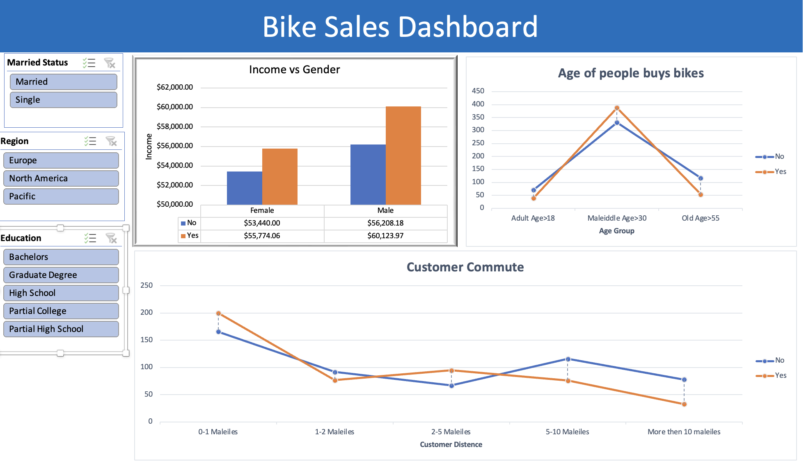

# 🚴 Bike Sales Dashboard

## 📊 Overview
The **Bike Sales Dashboard** is an interactive Excel project that analyzes customer behavior in bike purchasing. It provides insights into income, age groups, commute distance, and demographics.

---

## 📷 Dashboard Preview

---

## 🎯 Objectives
- Understand customer buying behavior  
- Identify key sales factors  
- Practice data analysis and visualization  
- Build an interactive dashboard  

---

## 🧩 Features

### 🔹 Interactive Filters
- Marital Status (Married / Single)  
- Region (Europe, North America, Pacific)  
- Education Level  

### 📈 Visualizations
- **Income vs Gender**  
- **Age Group Analysis**  
- **Customer Commute Distance**  

---

## 🛠️ Tools Used
- Microsoft Excel  
- Pivot Tables  
- Pivot Charts  
- Slicers  

---

## 📂 Project Structure
